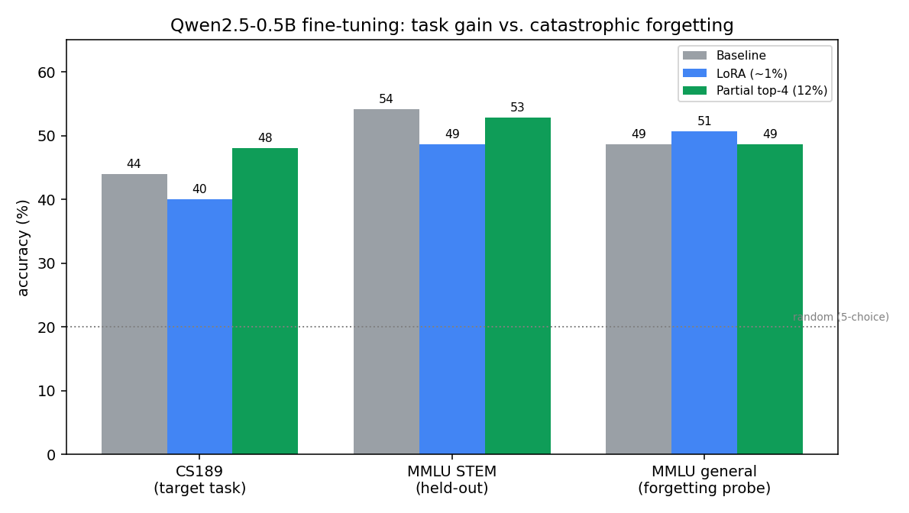

```{python}
#| echo: false
#| eval: false
import warnings
warnings.filterwarnings('ignore')
```

## Introduction

This project explores a central question in modern machine learning: **how far can a single architectural idea travel?** Starting from first principles, we build convolutional and transformer architectures from scratch in PyTorch, then apply the same transfer-learning playbook to data that looks nothing like what these models were designed for — raw DNA sequences and urban audio clips.

The project spans four main arcs:

1. **Building from scratch** — Implement a CNN, ResNet-18 with residual connections, and a full encoder–decoder Transformer, training each on image and text datasets.
2. **Adapting to genomics** — Fine-tune DNABERT, a BERT-based transformer pretrained on DNA k-mers, to classify DNA sequences by species (human, chimpanzee, dog).
3. **Reframing sound as vision** — Convert raw audio waveforms into mel spectrograms and fine-tune a pretrained ConvNeXt model for 10-class urban sound classification, comparing three fine-tuning paradigms.
4. **Fine-tuning a language model** — Adapt Qwen2.5-0.5B for multiple-choice QA with LoRA and partial fine-tuning, then use a properly-sized held-out test to weigh task transfer, **catastrophic forgetting**, and how fine-tuning stacks up against **in-context learning**.

::: {.callout-important title="Headline result"}
On a **169-question hidden test**, the base Qwen2.5-0.5B model given **four worked examples in its prompt scored 0.423 — beating supervised fine-tuning (0.340)** with no weight updates at all. Neither LoRA nor partial fine-tuning caused catastrophic forgetting. A 25-question local gauge had pointed the opposite way, which is why the properly sized held-out test matters. Details in [The decisive test](#the-decisive-test-169-hidden-questions).
:::

---

## Setup

```{python}
import numpy as np
import torch
import torch.nn as nn
import torch.nn.functional as F
from torch.optim import AdamW
import random
import os
import json
import re
from tqdm import tqdm
from torch.utils.data import DataLoader, Dataset
import torchvision.transforms as transforms
import matplotlib.pyplot as plt
import warnings
warnings.filterwarnings('ignore')

def set_seed(seed=42):
    random.seed(seed)
    np.random.seed(seed)
    torch.manual_seed(seed)
    torch.cuda.manual_seed(seed)
    torch.cuda.manual_seed_all(seed)

SEED = 42
set_seed(SEED)

if torch.accelerator.is_available():
    device = torch.accelerator.current_accelerator()
else:
    device = "cpu"

print(f"Using device: {device}")
```

---

## Part 1: Convolutional Neural Networks

### Background

PyTorch organizes neural networks around `nn.Module` — a composable building block that tracks learnable parameters and defines a forward pass. The two key methods every module needs are `__init__` (where layers are declared as instance attributes so PyTorch registers them for backprop) and `forward` (where data flows through those layers).

Convolutional layers learn spatial filters that slide across an image, detecting edges, textures, and higher-level patterns as depth increases. Each `Conv2d` layer has learnable kernel weights; `ReLU` introduces non-linearity without changing spatial dimensions; and a final `Linear` layer maps the flattened feature map to class logits.

### CNN Architecture

```{python}
class CNN(nn.Module):
    def __init__(self, num_classes):
        super().__init__()
        self.conv1 = nn.Conv2d(in_channels=3, out_channels=16, kernel_size=3, stride=2, padding=1)
        self.conv2 = nn.Conv2d(in_channels=16, out_channels=16, kernel_size=7, stride=2, padding=1)
        self.linear = nn.Linear(16 * 54 * 54, num_classes)

    def forward(self, x):
        x = F.relu(self.conv1(x))
        x = F.relu(self.conv2(x))
        x = x.flatten(start_dim=1)
        return self.linear(x)
```

::: {.callout-note}
**Shape trace for a (1, 3, 224, 224) input through CNN(num_classes=10):**

| Layer | Output shape |
|---|---|
| Input | 1 × 3 × 224 × 224 |
| conv1 (stride=2) | 1 × 16 × 112 × 112 |
| ReLU | 1 × 16 × 112 × 112 |
| conv2 (stride=2, kernel=7) | 1 × 16 × 54 × 54 |
| ReLU | 1 × 16 × 54 × 54 |
| Flatten | 1 × 46656 |
| Linear | 1 × 10 |
:::

### Data Loading — Mini ImageNet

Training on 10 balanced classes from Mini ImageNet (1,000 training / 200 validation images). Images are resized and center-cropped to 224×224 and normalized with ImageNet statistics to ensure compatibility with pretrained weight distributions.

```{python}
from datasets import load_dataset

def balanced_split(dataset, n_total, classes_to_keep=None):
    """Return a balanced subset of n_total samples across selected classes."""
    if not classes_to_keep:
        classes_to_keep = set(dataset['label'])
    n_per_class = n_total // len(classes_to_keep)
    cls_to_indices = {cls: [] for cls in classes_to_keep}
    for i, cls in enumerate(dataset['label']):
        if cls in cls_to_indices:
            cls_to_indices[cls].append(i)
    sampled_idxs = []
    for cls, idx_list in cls_to_indices.items():
        sampled_idxs.extend(
            random.sample(idx_list, k=min(len(idx_list), n_per_class))
        )
    return dataset.select(sampled_idxs)

class MiniImageNetDataset(Dataset):
    def __init__(self, dataset, class_id_to_name, split="train", transform=None):
        self.dataset = dataset
        self.class_id_to_name = class_id_to_name
        self.split = split
        self.transform = transform

    def __len__(self):
        return len(self.dataset)

    def __getitem__(self, index):
        sample = self.dataset[index]
        image = sample['image'].convert("RGB")
        label = sample['label']
        if self.transform:
            item = self.transform(image)
        else:
            item = torch.tensor(np.array(image), dtype=torch.float).permute(2, 0, 1)
        return item, torch.tensor(label, dtype=torch.long)

train_transform = transforms.Compose([
    transforms.Resize(256),
    transforms.RandomCrop(224),
    transforms.RandomHorizontalFlip(),
    transforms.ToTensor(),
    transforms.Normalize(mean=[0.485, 0.456, 0.406], std=[0.229, 0.224, 0.225])
])

val_transform = transforms.Compose([
    transforms.Resize(256),
    transforms.CenterCrop(224),
    transforms.ToTensor(),
    transforms.Normalize(mean=[0.485, 0.456, 0.406], std=[0.229, 0.224, 0.225])
])
```

### Training Loop

A standard PyTorch training loop: zero gradients → forward pass → loss → backward → optimizer step. Validation runs under `torch.no_grad()` to avoid unnecessary gradient computation.

```{python}
def train(model, optimizer, criterion, num_epochs, train_dataloader, val_dataloader=None):
    model.to(device)
    train_accuracies, train_losses, val_accuracies, val_losses = [], [], [], []

    for epoch in tqdm(range(num_epochs), desc="Training"):
        model.train()
        train_loss, train_correct = 0.0, 0.0

        for x, y in train_dataloader:
            x = x.to(device, dtype=torch.float)
            y = y.to(device, dtype=torch.long)
            optimizer.zero_grad()
            y_hat = model(x)
            loss = criterion(y_hat, y)
            loss.backward()
            optimizer.step()
            train_loss += loss.item()
            preds = torch.argmax(y_hat, dim=1)
            train_correct += (preds == y).sum().item()

        train_losses.append(train_loss / len(train_dataloader))
        train_accuracies.append(train_correct / len(train_dataloader.dataset))

        if val_dataloader:
            model.eval()
            val_loss, val_correct = 0.0, 0.0
            with torch.no_grad():
                for x, y in val_dataloader:
                    x = x.to(device, dtype=torch.float)
                    y = y.to(device, dtype=torch.long)
                    y_hat = model(x)
                    loss = criterion(y_hat, y)
                    val_loss += loss.item()
                    preds = torch.argmax(y_hat, dim=1)
                    val_correct += (preds == y).sum().item()
            val_losses.append(val_loss / len(val_dataloader))
            val_accuracies.append(val_correct / len(val_dataloader.dataset))

    return train_accuracies, train_losses, val_accuracies, val_losses
```

### CNN Training Results

```{python}
#| eval: false
cnn = CNN(num_classes=10)
optimizer = AdamW(cnn.parameters(), lr=1e-3)
criterion = nn.CrossEntropyLoss()

cnn_train_acc, cnn_train_loss, cnn_val_acc, cnn_val_loss = train(
    cnn, optimizer, criterion, num_epochs=20,
    train_dataloader=train_dataloader, val_dataloader=val_dataloader
)
```

::: {.callout-note}
After 20 epochs, the CNN reaches approximately **50% training accuracy** on 10 Mini ImageNet classes — a reasonable baseline given the small dataset and shallow architecture.
:::

```{python}
def plot_metrics(train_losses, val_losses, train_accs=None, val_accs=None, title=""):
    #| fig-cap: "Training and validation metrics over epochs"
    fig, axes = plt.subplots(1, 2, figsize=(12, 4))
    axes[0].plot(train_losses, label="Train")
    axes[0].plot(val_losses, label="Val")
    axes[0].set_title(f"{title} — Loss")
    axes[0].set_xlabel("Epoch"); axes[0].legend()
    if train_accs:
        axes[1].plot(train_accs, label="Train")
        axes[1].plot(val_accs, label="Val")
        axes[1].set_title(f"{title} — Accuracy")
        axes[1].set_xlabel("Epoch"); axes[1].legend()
    plt.tight_layout(); plt.show()
```

---

## Part 2: Residual Networks

### Why Residual Connections?

Deep networks suffer from two compounding problems: **vanishing gradients** (upstream gradients shrink exponentially as they propagate backward through many layers) and **accuracy degradation** (adding more layers can actually hurt performance, even on training data). He et al. (2015) solved both with a simple architectural change: let each block learn a *residual* mapping $g(x) = f(x) - x$ and add the original input back.

$$\text{output} = g(x) + x = f(x)$$

The skip connection ensures that even if $g(x) \approx 0$, the block still passes $x$ forward unchanged — the network never loses information by adding depth. More practically, the backward pass now includes a direct path through the `+1` term in the chain rule, keeping gradients alive in early layers.

### Residual Block

```{python}
class ResidualBlock(nn.Module):
    def __init__(self, in_channels=64, out_channels=64, initial_downsample=False):
        super().__init__()
        stride = 2 if initial_downsample else 1
        self.conv1 = nn.Conv2d(in_channels, out_channels, kernel_size=3, stride=stride, padding=1, bias=False)
        self.batchnorm1 = nn.BatchNorm2d(out_channels)
        self.conv2 = nn.Conv2d(out_channels, out_channels, kernel_size=3, stride=1, padding=1, bias=False)
        self.batchnorm2 = nn.BatchNorm2d(out_channels)
        self.residual_connection = nn.Conv2d(in_channels, out_channels, kernel_size=1, stride=stride, bias=False)

    def forward(self, x):
        residual = self.residual_connection(x)
        out = F.relu(self.batchnorm1(self.conv1(x)))
        out = self.batchnorm2(self.conv2(out))
        return F.relu(out + residual)
```

### ResNet-18 Architecture

ResNet-18 chains an initial 7×7 convolution with four stages of residual blocks (64 → 128 → 256 → 512 channels), each stage halving spatial resolution via stride-2 downsampling in its first block.

```{python}
class ResNet18(nn.Module):
    def __init__(self, num_classes=10):
        super().__init__()
        self.stem = nn.Sequential(
            nn.Conv2d(3, 64, kernel_size=7, stride=2, padding=3, bias=False),
            nn.BatchNorm2d(64),
            nn.ReLU(inplace=True),
            nn.MaxPool2d(kernel_size=3, stride=2, padding=1)
        )
        self.stage1 = nn.Sequential(
            ResidualBlock(64, 64),
            ResidualBlock(64, 64)
        )
        self.stage2 = nn.Sequential(
            ResidualBlock(64, 128, initial_downsample=True),
            ResidualBlock(128, 128)
        )
        self.stage3 = nn.Sequential(
            ResidualBlock(128, 256, initial_downsample=True),
            ResidualBlock(256, 256)
        )
        self.stage4 = nn.Sequential(
            ResidualBlock(256, 512, initial_downsample=True),
            ResidualBlock(512, 512)
        )
        self.head = nn.Sequential(
            nn.AdaptiveAvgPool2d((1, 1)),
            nn.Flatten(),
            nn.Linear(512, num_classes)
        )

    def forward(self, x):
        x = self.stem(x)
        x = self.stage1(x)
        x = self.stage2(x)
        x = self.stage3(x)
        x = self.stage4(x)
        return self.head(x)
```

### ResNet-18 Training Results

```{python}
#| eval: false
resnet = ResNet18(num_classes=10)
optimizer = AdamW(resnet.parameters(), lr=1e-3)
criterion = nn.CrossEntropyLoss()

resnet_train_acc, resnet_train_loss, resnet_val_acc, resnet_val_loss = train(
    resnet, optimizer, criterion, num_epochs=50,
    train_dataloader=train_dataloader, val_dataloader=val_dataloader
)
```

::: {.callout-important}
ResNet-18 achieves approximately **70% training accuracy** and **50% validation accuracy** after 50 epochs — a clear improvement over the plain CNN. The residual connections allow the deeper architecture to actually benefit from its depth, instead of degrading as layers are added.
:::

---

## Part 3: Transformers from Scratch

### Background

Transformers replace sequential processing with **attention** — a mechanism that lets every position in a sequence directly attend to every other position in a single operation. The core computation is scaled dot-product attention:

$$\text{Attention}(Q, K, V) = \text{softmax}\!\left(\frac{QK^\top}{\sqrt{d_k}}\right)\!V$$

The query vector $q_i$ asks "what am I looking for?" and is matched against key vectors $k_j$ for each other position. The dot products become attention weights after softmax scaling, and are used to form a weighted sum of value vectors $v_j$. By computing this simultaneously for all positions, transformers are highly parallelizable and can model long-range dependencies that RNNs struggle with.

### Softmax

```{python}
def softmax(x: torch.Tensor) -> torch.Tensor:
    x_stable = x - x.max(dim=-1, keepdim=True).values
    exp_x = torch.exp(x_stable)
    return exp_x / exp_x.sum(dim=-1, keepdim=True)
```

### Scaled Dot-Product Attention

```{python}
def scaled_dot_product_attention(Q, K, V, mask=None):
    d_k = Q.shape[-1]
    scores = torch.bmm(Q, K.transpose(-2, -1)) / (d_k ** 0.5)
    if mask is not None:
        scores = scores.masked_fill(mask, float('-inf'))
    weights = softmax(scores)
    return torch.bmm(weights, V)
```

### Attention Head

Each head projects inputs into its own Q/K/V subspace of dimension `d_k`, computes attention, and outputs a sequence of the same length.

```{python}
class AttentionHead(nn.Module):
    def __init__(self, d_model=512, d_k=64):
        super().__init__()
        self.W_q = nn.Linear(d_model, d_k)
        self.W_k = nn.Linear(d_model, d_k)
        self.W_v = nn.Linear(d_model, d_k)

    def forward(self, x, encoder_output=None, mask=None):
        Q = self.W_q(x)
        K = self.W_k(encoder_output if encoder_output is not None else x)
        V = self.W_v(encoder_output if encoder_output is not None else x)
        return scaled_dot_product_attention(Q, K, V, mask)
```

### Multi-Head Attention

Running `h` heads in parallel lets the model simultaneously attend to different representation subspaces — syntax vs. semantics, local vs. global patterns.

```{python}
class MultiHeadAttention(nn.Module):
    def __init__(self, num_heads=8, d_model=512):
        super().__init__()
        self.d_k = d_model // num_heads
        self.heads = nn.ModuleList([AttentionHead(d_model, self.d_k) for _ in range(num_heads)])
        self.W_out = nn.Linear(d_model, d_model)

    def forward(self, x, encoder_output=None, mask=None):
        head_outputs = [h(x, encoder_output, mask) for h in self.heads]
        return self.W_out(torch.cat(head_outputs, dim=-1))
```

### Encoder Layer

Each encoder layer wraps multi-head self-attention and a position-wise FFN in residual + LayerNorm pairs, following the original "Post-LN" Transformer design.

```{python}
class EncoderLayer(nn.Module):
    def __init__(self, d_model=512, num_heads=8):
        super().__init__()
        self.attention = MultiHeadAttention(num_heads, d_model)
        d_ffn = 4 * d_model
        self.ffn = nn.Sequential(
            nn.Linear(d_model, d_ffn), nn.ReLU(), nn.Linear(d_ffn, d_model)
        )
        self.norm1 = nn.LayerNorm(d_model)
        self.norm2 = nn.LayerNorm(d_model)

    def forward(self, x, mask=None):
        x = self.norm1(x + self.attention(x, mask=mask))
        x = self.norm2(x + self.ffn(x))
        return x
```

### Decoder Layer

The decoder adds a second attention block for **cross-attention**: queries come from the decoder, keys and values come from the encoder output. A causal mask on self-attention prevents positions from attending to future tokens.

```{python}
class DecoderLayer(nn.Module):
    def __init__(self, d_model=512, num_heads=8):
        super().__init__()
        self.self_attention = MultiHeadAttention(num_heads, d_model)
        self.cross_attention = MultiHeadAttention(num_heads, d_model)
        d_ffn = 4 * d_model
        self.ffn = nn.Sequential(
            nn.Linear(d_model, d_ffn), nn.ReLU(), nn.Linear(d_ffn, d_model)
        )
        self.norm1 = nn.LayerNorm(d_model)
        self.norm2 = nn.LayerNorm(d_model)
        self.norm3 = nn.LayerNorm(d_model)

    def forward(self, x, encoder_output=None):
        seq_len = x.shape[1]
        causal_mask = torch.triu(torch.ones(seq_len, seq_len, dtype=torch.bool), diagonal=1).to(x.device)
        x = self.norm1(x + self.self_attention(x, mask=causal_mask))
        if encoder_output is not None:
            x = self.norm2(x + self.cross_attention(x, encoder_output=encoder_output))
        x = self.norm3(x + self.ffn(x))
        return x
```

### Positional Encoding

Transformers process all tokens simultaneously and have no built-in sense of position. Sinusoidal positional encodings inject position information: even dimensions use sine, odd dimensions use cosine, each at a different frequency controlled by the token index and embedding dimension.

$$PE_{(pos,2i)} = \sin\!\left(\frac{pos}{10000^{2i/d_\text{model}}}\right), \quad PE_{(pos,2i+1)} = \cos\!\left(\frac{pos}{10000^{2i/d_\text{model}}}\right)$$

```{python}
class PositionalEncoding(nn.Module):
    def __init__(self, d_model, max_len=1024):
        super().__init__()
        pe = torch.zeros(max_len, d_model)
        pos = torch.arange(0, max_len).unsqueeze(1).float()
        div_term = torch.pow(10000.0, torch.arange(0, d_model, 2).float() / d_model)
        pe[:, 0::2] = torch.sin(pos / div_term)
        pe[:, 1::2] = torch.cos(pos / div_term)
        self.register_buffer('pe', pe.unsqueeze(0))

    def forward(self, x):
        return x + self.pe[:, :x.shape[1], :].to(x.device)
```

### Full Transformer

```{python}
class TransformerEncoder(nn.Module):
    def __init__(self, vocab_size=1024, d_model=512, num_layers=6, num_heads=8):
        super().__init__()
        self.embedding = nn.Embedding(vocab_size, d_model)
        self.pos_encoding = PositionalEncoding(d_model)
        self.layers = nn.ModuleList([EncoderLayer(d_model, num_heads) for _ in range(num_layers)])

    def forward(self, x):
        x = self.pos_encoding(self.embedding(x))
        for layer in self.layers:
            x = layer(x)
        return x


class TransformerDecoder(nn.Module):
    def __init__(self, vocab_size=1024, d_model=512, num_layers=6, num_heads=8):
        super().__init__()
        self.embedding = nn.Embedding(vocab_size, d_model)
        self.pos_encoding = PositionalEncoding(d_model)
        self.layers = nn.ModuleList([DecoderLayer(d_model, num_heads) for _ in range(num_layers)])
        self.head = nn.Linear(d_model, vocab_size)

    def forward(self, x, encoder_output=None):
        x = self.pos_encoding(self.embedding(x))
        for layer in self.layers:
            x = layer(x, encoder_output)
        return self.head(x)


class Transformer(nn.Module):
    def __init__(self, vocab_size=1024, d_model=512, num_layers=6, num_heads=8, decoder_only=False):
        super().__init__()
        self.decoder_only = decoder_only
        self.encoder = TransformerEncoder(vocab_size, d_model, num_layers, num_heads)
        self.decoder = TransformerDecoder(vocab_size, d_model, num_layers, num_heads)

    def forward(self, x, target=None):
        if self.decoder_only:
            return self.decoder(x, encoder_output=None)
        encoder_output = self.encoder(x)
        return self.decoder(target, encoder_output)
```

### Text Generation on TinyStories

The Transformer is trained in decoder-only mode on the TinyStories dataset — short stories generated to have simple sentence structure — learning next-token prediction. At inference, the model generates text autoregressively: it samples the next token, appends it to the context, and repeats.

::: {.callout-note}
The decoder-only configuration skips cross-attention entirely. This is the same design choice behind GPT — the encoder is not needed when the goal is generation rather than sequence-to-sequence translation.
:::

---

## Part 4: Fine-Tuning on Non-Standard Modalities

### The Transfer Learning Argument

Training large models from scratch is expensive and data-hungry. Transfer learning inverts the workflow: start from a model that has already learned general representations on a large dataset, then fine-tune its weights on the target task with limited labeled data. The pretrained backbone has already solved the "what features matter" problem; the classifier head needs only to learn the decision boundary.

This is especially powerful for **non-standard modalities** where labeled data is scarce. A BERT model pretrained on billions of DNA k-mers captures biological sequence structure that would take enormous datasets to learn from scratch. A ConvNeXt pretrained on ImageNet has learned filters for textures, edges, and shapes that transfer surprisingly well to spectrogram images.

---

## Part 4a: DNA Classification with DNABERT

### What is DNABERT?

DNABERT adapts the BERT (Bidirectional Encoder Representations from Transformers) architecture for DNA sequence analysis. Rather than word tokens, it uses **k-mer tokenization**: a DNA sequence is split into overlapping substrings of length $k$. For $k=6$, the sequence `ATGGCTA` becomes `ATGGCT TGGCTA`.

The model has the same architecture as BERT-base:
- 12 transformer encoder layers
- 768 hidden dimensions per layer
- 12 attention heads
- ~110M parameters

It was pretrained on large unlabeled genomic datasets using masked k-mer prediction, learning representations that capture both local sequence patterns and long-range dependencies.

### K-mer Tokenization

```{python}
def sequence_to_kmer(sequence, k=6):
    """Convert a DNA sequence string into a space-separated string of overlapping k-mers."""
    return ' '.join([sequence[i:i+k] for i in range(len(sequence) - k + 1)])
```

### Data Loading

Three species (human, chimpanzee, dog) with DNA sequences labeled by gene family. We create a balanced dataset by sampling the same number from each species, then convert sequences to k-mers.

```{python}
import pandas as pd
from sklearn.model_selection import train_test_split

species_to_target = {'chimpanzee': 0, 'dog': 1, 'human': 2}

# Load and combine species dataframes
def load_dna_data(data_dir='data/'):
    dfs = []
    for species, target in species_to_target.items():
        df = pd.read_table(f'{data_dir}{species}_train.txt')
        df = df.rename(columns={'class': 'gene_family'})
        df['species'] = species
        df['target'] = target
        dfs.append(df)
    num_samples = min(len(d) for d in dfs)
    combined = pd.concat([d.sample(num_samples, random_state=SEED) for d in dfs], ignore_index=True)
    combined['kmers'] = combined['sequence'].apply(sequence_to_kmer)
    return combined
```

### DNAClassifier: DNABERT + Classification Head

BERT-based models output a hidden state of shape `[batch, seq_len, 768]`. The `[CLS]` token at position 0 is designed to aggregate sequence-level information — we extract its embedding and pass it to a linear classification head.

```{python}
from transformers import AutoTokenizer, AutoModel

class DNAClassifier(nn.Module):
    def __init__(self, num_classes=3):
        super().__init__()
        self.backbone = AutoModel.from_pretrained(
            "zhihan1996/DNA_bert_6",
            trust_remote_code=True,
            revision="c56e67ea5827e0ddc67ef059addcf71569b1216e"
        )
        self.classifier = nn.Linear(768, num_classes)

    def forward(self, input_ids, attention_mask):
        outputs = self.backbone(input_ids=input_ids, attention_mask=attention_mask)
        cls_embedding = outputs.last_hidden_state[:, 0, :]  # [CLS] token
        return self.classifier(cls_embedding)
```

### DNADataset

```{python}
class DNADataset(Dataset):
    def __init__(self, kmers, targets=None, tokenizer=None, return_targets=True):
        super().__init__()
        self.kmers = kmers
        self.targets = targets
        self.return_targets = return_targets
        self.tokenizer = tokenizer or AutoTokenizer.from_pretrained(
            "zhihan1996/DNA_bert_6", trust_remote_code=True,
            revision="c56e67ea5827e0ddc67ef059addcf71569b1216e"
        )

    def __len__(self):
        return len(self.kmers)

    def __getitem__(self, idx):
        kmer = self.kmers[idx]
        tokens = self.tokenizer(kmer, return_tensors='pt', max_length=512,
                                truncation=True, padding='max_length')
        input_ids = tokens['input_ids'].squeeze(0)
        attention_mask = tokens['attention_mask'].squeeze(0)
        if self.return_targets:
            target = torch.tensor(self.targets[idx], dtype=torch.long)
            return {'input_ids': input_ids, 'attention_mask': attention_mask, 'targets': target}
        return {'input_ids': input_ids, 'attention_mask': attention_mask}
```

### Training the DNA Classifier

```{python}
def train_dna_classifier(model, optimizer, criterion, device, num_epochs,
                          train_dataloader, val_dataloader):
    model.to(device)
    train_losses, val_losses, train_accuracies, val_accuracies = [], [], [], []

    for epoch in range(num_epochs):
        model.train()
        train_loss, train_correct = 0.0, 0

        for batch in train_dataloader:
            input_ids = batch['input_ids'].to(device)
            attention_mask = batch['attention_mask'].to(device)
            targets = batch['targets'].to(device)

            optimizer.zero_grad()
            logits = model(input_ids, attention_mask)
            loss = criterion(logits, targets)
            loss.backward()
            optimizer.step()

            train_loss += loss.item()
            _, preds = torch.max(logits, dim=1)
            train_correct += (preds == targets).sum().item()

        train_losses.append(train_loss / len(train_dataloader))
        train_accuracies.append(train_correct / len(train_dataloader.dataset))

        model.eval()
        val_loss, val_correct = 0.0, 0
        with torch.no_grad():
            for batch in val_dataloader:
                input_ids = batch['input_ids'].to(device)
                attention_mask = batch['attention_mask'].to(device)
                targets = batch['targets'].to(device)
                logits = model(input_ids, attention_mask)
                loss = criterion(logits, targets)
                val_loss += loss.item()
                _, preds = torch.max(logits, dim=1)
                val_correct += (preds == targets).sum().item()

        val_losses.append(val_loss / len(val_dataloader))
        val_accuracies.append(val_correct / len(val_dataloader.dataset))
        print(f"Epoch {epoch+1}: train_acc={train_accuracies[-1]:.3f}, val_acc={val_accuracies[-1]:.3f}")

    return train_losses, val_losses, train_accuracies, val_accuracies
```

::: {.callout-important}
**Key design choice:** only the classification head is trained by default. The DNABERT backbone weights are frozen, so the model learns to classify based on the rich genomic representations DNABERT already knows. Fine-tuning all layers would require more labeled data and longer training.
:::

---

## Part 4b: Urban Sound Classification with ConvNeXt

### Reframing Audio as a Vision Problem

Raw audio is a one-dimensional waveform — a time series of amplitude values. Computer vision models expect two-dimensional images. The bridge: **mel spectrograms**.

The Short-Time Fourier Transform (STFT) computes the frequency content of overlapping windows of the waveform. The result is a matrix where:
- x-axis = time bins
- y-axis = frequency bins
- values = amplitude (energy) at each frequency and time

This matrix is a 2D image. By treating spectrograms as images, we can directly apply the pattern-recognition machinery of convolutional vision models to sound classification.

### SpectrogramDataset

```{python}
import torchaudio

class SpectrogramDataset(Dataset):
    def __init__(self, audio_dir, transforms=None, spectrogram_transform=None, return_targets=True):
        super().__init__()
        self.audio_dir = audio_dir
        self.transforms = transforms
        self.spectrogram_transform = spectrogram_transform or torchaudio.transforms.Spectrogram(
            n_fft=1024, normalized=True
        )
        self.return_targets = return_targets
        try:
            self.file_paths = [f for f in os.listdir(audio_dir) if f.endswith('.wav')]
        except Exception as e:
            print(f"Error: {e}")
            self.file_paths = []

    def __len__(self):
        return len(self.file_paths)

    def __getitem__(self, index):
        file_name = self.file_paths[index]
        filepath = os.path.join(self.audio_dir, file_name)

        if self.return_targets:
            # Filename format: [fsID]-[classID]-[occurrenceID]-[sliceID].wav
            class_id = int(file_name.split('-')[1])
            target = torch.tensor(class_id, dtype=torch.long)

        try:
            waveform, _ = torchaudio.load(filepath)
            waveform = waveform.mean(dim=0, keepdim=True)  # stereo → mono
            spec = self.spectrogram_transform(waveform)      # (1, H, W)
            spec = spec.expand(3, -1, -1)                    # (3, H, W) for ConvNeXt

            if self.transforms:
                spec = self.transforms(spec)

            return (spec, target) if self.return_targets else spec
        except Exception as e:
            print(f"Error processing {filepath}: {e}")
            return (None, None) if self.return_targets else None
```

::: {.callout-note}
The spectrogram has one channel (grayscale energy), but ConvNeXt expects 3-channel RGB input. Expanding to 3 channels by repeating is a simple and effective trick — the model quickly learns that all three channels are identical and adapts its first-layer filters accordingly.
:::

### ConvNeXt Architecture

ConvNeXt (Liu et al., 2022) is a modern convolutional network designed to match Vision Transformers in accuracy while retaining the efficiency of convolutions. It borrows from Transformer design without using attention: large kernels (7×7) for global receptive fields, Layer Normalization instead of BatchNorm, GELU activations, and an inverted bottleneck block structure.

ConvNeXt was pretrained on ImageNet-1k (1000 classes). To use it for 10-class urban sound classification, the final linear layer is replaced.

```{python}
from torchvision.models import convnext_base, ConvNeXt_Base_Weights

def build_convnext(num_classes=10, pretrained=True, freeze_backbone=False):
    """Load ConvNeXt-Base and adapt it for num_classes."""
    weights = ConvNeXt_Base_Weights.IMAGENET1K_V1 if pretrained else None
    model = convnext_base(weights=weights)

    if freeze_backbone:
        for param in model.features.parameters():
            param.requires_grad = False

    in_features = model.classifier[-1].in_features
    model.classifier[-1] = nn.Linear(in_features, num_classes)
    return model
```

### Three Fine-Tuning Paradigms

```{python}
class_id_to_sound = {
    0: "air_conditioner", 1: "car_horn", 2: "children_playing",
    3: "dog_bark", 4: "drilling", 5: "engine_idling",
    6: "gun_shot", 7: "jackhammer", 8: "siren", 9: "street_music"
}

# Paradigm 1: Train from scratch (random weights)
model_scratch = build_convnext(num_classes=10, pretrained=False, freeze_backbone=False)

# Paradigm 2: Frozen backbone — only train the classification head
model_frozen = build_convnext(num_classes=10, pretrained=True, freeze_backbone=True)

# Paradigm 3: Full fine-tuning — update all weights
model_full = build_convnext(num_classes=10, pretrained=True, freeze_backbone=False)
```

### Training Loop for Image Classifiers

```{python}
def train_image_classifier(model, optimizer, criterion, device, num_epochs,
                            train_dataloader, val_dataloader):
    model.to(device)
    train_losses, val_losses, train_accuracies, val_accuracies = [], [], [], []

    for epoch in range(num_epochs):
        model.train()
        train_loss, train_correct = 0.0, 0

        for x, y in train_dataloader:
            x = x.to(device, dtype=torch.float)
            y = y.to(device, dtype=torch.long)
            optimizer.zero_grad()
            y_hat = model(x)
            loss = criterion(y_hat, y)
            loss.backward()
            optimizer.step()
            train_loss += loss.item()
            _, preds = torch.max(y_hat, dim=1)
            train_correct += (preds == y).sum().item()

        train_losses.append(train_loss / len(train_dataloader))
        train_accuracies.append(train_correct / len(train_dataloader.dataset))

        model.eval()
        val_loss, val_correct = 0.0, 0
        with torch.no_grad():
            for x, y in val_dataloader:
                x = x.to(device, dtype=torch.float)
                y = y.to(device, dtype=torch.long)
                y_hat = model(x)
                loss = criterion(y_hat, y)
                val_loss += loss.item()
                _, preds = torch.max(y_hat, dim=1)
                val_correct += (preds == y).sum().item()

        val_losses.append(val_loss / len(val_dataloader))
        val_accuracies.append(val_correct / len(val_dataloader.dataset))
        print(f"Epoch {epoch+1}: train_acc={train_accuracies[-1]:.3f}, val_acc={val_accuracies[-1]:.3f}")

    return train_losses, val_losses, train_accuracies, val_accuracies
```

---

## Part 5: Instruction Fine-Tuning an LLM — Task Gains vs. Catastrophic Forgetting

The previous parts adapted pretrained *encoders* to new modalities. This final part turns to a *generative* language model and asks a sharper question about the cost of adaptation: **when we fine-tune a small instruction-tuned LLM to do better on a target task, how much of its general ability do we destroy in the process?** This tension — task gain versus **catastrophic forgetting** — is central to practical LLM fine-tuning.

**The short answer:** fine-tuning did not cause forgetting — but it also wasn't the best way to adapt this model. On a 169-question hidden test, simply placing four solved examples in the prompt (0.423) beat supervised fine-tuning (0.340).

The model is **Qwen2.5-0.5B-Instruct**, a 0.5-billion-parameter chat model. The target is CS189-style machine-learning multiple-choice questions; the training signal is a broad slice of **MMLU** (Massive Multitask Language Understanding). Everything below ran locally on an Apple M4 Pro (MPS) with HuggingFace `trl`'s `SFTTrainer`.

### Framing the task as supervised fine-tuning

Each question is rendered into a single canonical chat prompt whose target is the correct answer letter wrapped in `\boxed{}`. Using the *same* prompt for training and inference avoids any train/serve mismatch.

```{python}
def build_sft_text(row, tokenizer):
    messages = [
        {"role": "user",      "content": build_mcq_prompt(row)},           # question + options A–E
        {"role": "assistant", "content": f"\\boxed{{{row['answer']}}}"},    # target = boxed letter
    ]
    return tokenizer.apply_chat_template(messages, tokenize=False, add_generation_prompt=False)
```

### A data design that isolates forgetting

The subtlety in measuring forgetting is that you must evaluate general ability on data the model **never trained on**. So the MMLU subjects are split into two disjoint pools:

- **Task pool** (STEM/ML: `machine_learning`, `college_computer_science`, `college_mathematics`, …) — the model *trains* on most of this, and a held-out slice measures **task transfer**.
- **General pool** (`philosophy`, `world_religions`, `nutrition`, `marketing`, …) — **never trained on**, so any drop here after fine-tuning is genuine forgetting, not a distribution mismatch.

The 25 provided CS189 sample questions are held out entirely as an independent target-task gauge.

### Robust evaluation: likelihood scoring

A 0.5B model asked to "answer with a boxed letter" will often ramble and never emit `\boxed{}`, breaking naive string parsing. Instead of generating text, we **score each option's `\boxed{X}` completion by log-likelihood** and take the arg-max — this can never produce an unparseable answer.

```{python}
@torch.no_grad()
def completion_loglik(model, tok, prefix, completion):
    prefix_ids = tok(prefix, return_tensors="pt").input_ids
    full_ids   = tok(prefix + completion, return_tensors="pt").input_ids
    logp = torch.log_softmax(model(full_ids).logits[0].float(), dim=-1)
    comp_len = full_ids.shape[1] - prefix_ids.shape[1]
    # sum log-prob of each completion token under the model
    return sum(logp[full_ids.shape[1] - comp_len + i - 1, full_ids[0, full_ids.shape[1] - comp_len + i]].item()
               for i in range(comp_len))

# predicted answer = argmax over options of completion_loglik(prompt, f"\\boxed{{{letter}}}")
```

### Three regimes on the LoRA → full-fine-tuning spectrum

We compare how much of the network we allow training to perturb:

```{python}
# 1) LoRA — inject low-rank adapters, ~1% of parameters trainable
peft_config = LoraConfig(
    r=16, lora_alpha=32, lora_dropout=0.05,
    target_modules=["q_proj", "k_proj", "v_proj", "o_proj",
                    "gate_proj", "up_proj", "down_proj"],
    task_type="CAUSAL_LM",
)

# 2) Partial fine-tuning — freeze everything, then unfreeze only the TOP 4 transformer
#    blocks + final norm (~12% of parameters). Real weight updates, but memory-bounded.
for p in model.parameters():
    p.requires_grad = False
for layer in model.model.layers[-4:]:
    for p in layer.parameters():
        p.requires_grad = True

# 3) Full fine-tuning — all 494M parameters trainable (see note below).
```

An engineering aside that turned out to *be* a result: **full fine-tuning would not run.** All 494M parameters in fp32, plus their gradients and optimizer state, exceeded the 24 GB of unified memory (even with gradient checkpointing, batch size 1, and the memory-frugal Adafactor optimizer — it OOM'd every time). LoRA and partial fine-tuning succeeded precisely because they never materialize a full set of gradients. This is a concrete, first-hand demonstration of *why* parameter-efficient methods dominate real-world LLM work.

### Results

All three configurations share an identical (seeded) baseline and evaluation set, so any difference is attributable to the fine-tuning method alone.

| Approach | Trainable | CS189 (target) | MMLU STEM (held-out) | **MMLU general (forgetting probe)** | Overall |
|---|---:|---:|---:|---:|---:|
| Baseline (no fine-tuning) | — | 44.0 | 54.2 | 48.7 | 49.8 |
| LoRA | ~1% | 40.0 (−4.0) | 48.6 (−5.6) | 50.7 (**+2.0**) | 49.0 |
| Partial (top-4 layers) | 12% | **48.0 (+4.0)** | 52.8 (−1.4) | 48.7 (**0.0**) | 49.8 |
| Full fine-tuning | 100% | *infeasible* | *(24 GB OOM)* | *—* | *—* |

{fig-align="center" width="85%"}

### Interpretation

1. **No catastrophic forgetting occurred.** General-knowledge accuracy held flat or improved under *both* trainable regimes (LoRA +2.0, partial 0.0). For a 0.5B instruction model fine-tuned on in-domain MMLU, the feared collapse of general ability simply did not happen.
2. **On the local gauge, partial top-layer fine-tuning *looked* best** (CS189 +4.0) while preserving general accuracy exactly, edging out LoRA. But that gauge is only 25 questions — and the larger hidden test in the next section overturns this conclusion.
3. **Answer-only SFT is a weak learning signal.** Training loss and token accuracy improved steadily (loss 0.91 → 0.63), so the model *did* learn the objective — but predicting a bare answer letter teaches output *format* (which likelihood scoring bypasses) more than new knowledge, which is why task gains are modest at best.
4. **The local gauge is too small to trust.** With only 25 CS189 questions, ±4% is a single question. A reliable verdict needs a larger, truly held-out test — which is exactly what the Kaggle hidden set provides next.

### The decisive test: 169 hidden questions

To rank these approaches reliably we need more than 25 questions. The CS189 Kaggle competition supplies a **169-question hidden test set** — an order of magnitude larger, and never seen during any training or tuning. Alongside the fine-tuned models, I also evaluated the **base model with in-context learning**: instead of updating any weights, we simply place a few solved example questions in the prompt before the target question. Submitting each configuration gives the honest verdict (private leaderboard):

| Configuration | Method | Hidden-test accuracy |
|---|---|---:|
| Base model, zero-shot | prompting only | 0.329 |
| **Base model, 4-shot** | **in-context learning** | **0.423** |
| Base model, 8-shot | in-context learning | 0.388 |
| Partial fine-tuning (top-4 layers) | supervised fine-tuning | 0.340 |
| *Random guessing* | — | *0.200* |

{fig-align="center" width="85%"}

The larger test reverses the local-gauge story — and tells a more interesting one:

- **In-context learning beat supervised fine-tuning.** Four worked examples in the prompt (0.423) outperformed *every* fine-tuned model, including partial fine-tuning (0.340), with no weight updates at all.
- **Fine-tuning actively hurt.** The fine-tuned model (0.340) scored *below* the base model given a handful of in-context examples — consistent with answer-only SFT skewing the model's option distribution (it began over-predicting "D") rather than teaching it machine learning.
- **There is a shot sweet spot.** Accuracy rose from 0.329 (0-shot) to 0.423 (4-shot), then *fell* to 0.388 (8-shot): a 0.5B model has limited capacity to exploit long context, so too many demonstrations dilute the signal.

**Takeaway:** for a small model on a knowledge-heavy task, *how you prompt it* mattered more than *how you fine-tuned it* — and it took a properly sized, truly held-out evaluation to see that at all.

---

## Conclusions

::: {.callout-important}
**Key takeaways from this project:**

1. **Residual connections are not optional at depth.** ResNet-18 with skip connections substantially outperforms a plain CNN of similar parameter count — the architectural innovation matters as much as scale.

2. **Transformer components are modular.** Attention heads, encoder layers, and decoders are all composable building blocks. The same transformer code, with `decoder_only=True`, becomes a language model.

3. **Transfer learning is the right starting point for non-standard modalities.** Both DNABERT (pretrained on DNA) and ConvNeXt (pretrained on ImageNet) outperform training from scratch when labeled domain data is limited — because the hard work of learning general representations is already done.

4. **Any data that can be expressed as a matrix is fair game for vision models.** Converting audio to spectrograms is a single transform that unlocks the entire ecosystem of convolutional vision architectures.

5. **Frozen backbone vs. full fine-tuning is a tradeoff.** Frozen backbone trains faster and needs fewer labeled examples; full fine-tuning achieves higher accuracy when the target domain differs significantly from the pretraining domain.

6. **Parameter-efficient fine-tuning is a practical necessity, and forgetting is not automatic.** Full fine-tuning of even a 0.5B language model exceeded 24 GB of memory, while LoRA and partial fine-tuning ran comfortably — and neither caused catastrophic forgetting of general knowledge. Measuring the *absence* of forgetting, under a controlled held-out design, is as much a result as finding its presence.

7. **In-context learning can beat fine-tuning for a small model.** On the 169-question hidden test, placing four worked examples in the prompt (0.42) outperformed supervised fine-tuning (0.34) with no training at all — and a small, noisy evaluation set would have hidden this reversal entirely. Rigorous evaluation is not a formality; it is what separates a real result from a misleading one.
:::

---

*To re-render this report:*
```bash
/Applications/quarto/bin/quarto render deep_learning_nonstandard_modalities_2026-07-21.qmd
```
